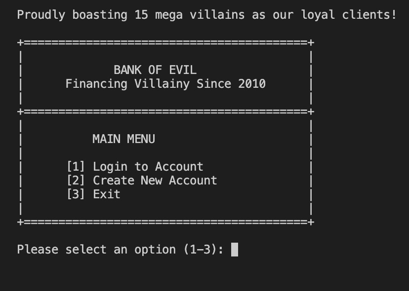
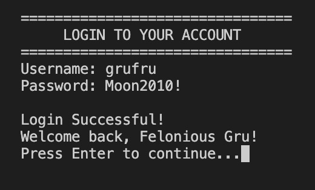
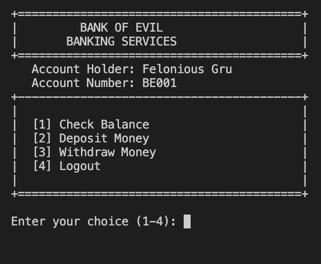
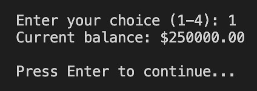
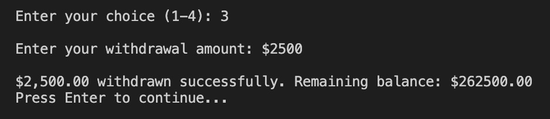
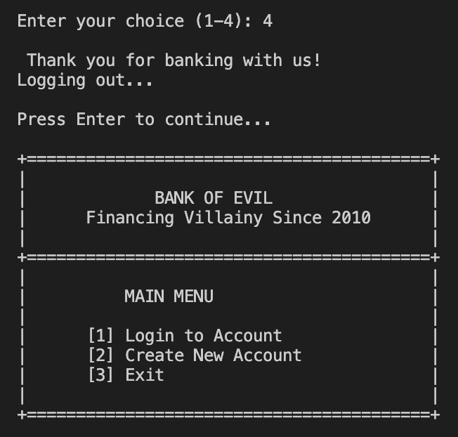
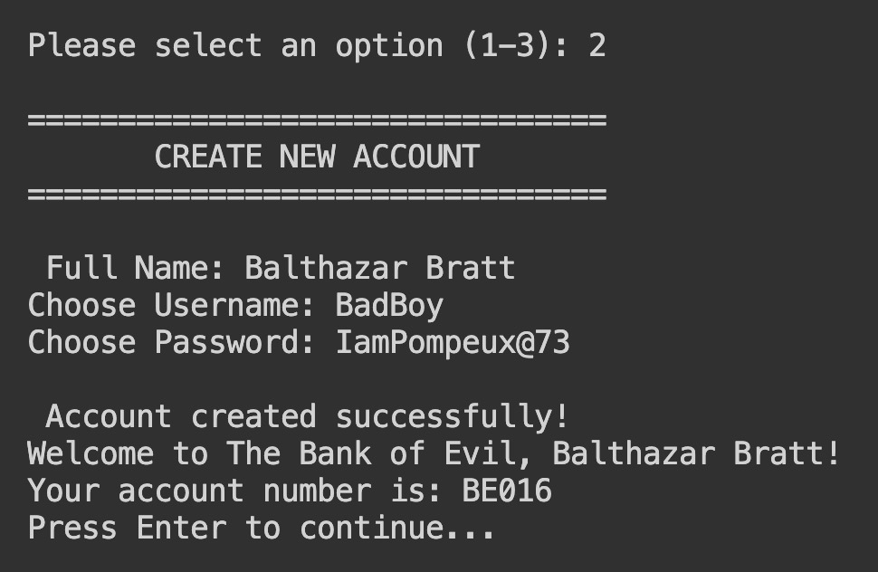
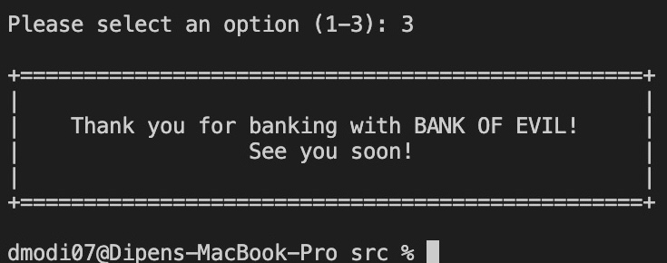

# Bank of Evil, Despicable Me.

My project was inspired by my visit to the ATM when I looked at the screen. For my project, I really wanted to create something more, like a banking app, with multiple features such as an option to make a deposit, or withdraw money or check balance in account. I also wanted to include the option to have 3 bank accounts - chequing account, savings account and an investment account with options to invest money in fixed interest bonds, and other risky growth investments. 

## Key Features
My project is based on the Bank of Evil, inspired from the movie Despicable Me, boasting some of the baddest villains of all time as loyal customers. Albeit, no matter how bad the villain is, he just cannot get past my (soon to be encrypted) user-authentication system. So each villain (oops, customer!) can only access their own account with their user id and password. If the user does not have an account with the Bank of Evil, the user can choose to either make an account or exit. Each new customer gets a unique account number representing their chequing account. Bank of Evil values their loyal customers and takes their data security extremely seriously. All data is securely stored in a secret JSON database (encryption coming soon!). Once logged in, our clients can check their balance, add more money or make a withdrawal.

## Guide
My project comprises of 5 files, namely -
1. main.py
2. jobs.py
3. bank_account.py
4. clients.json
5. test.py

Each file serves a purpose. `jobs.py` is a python file containing all my helper functions. `bank_account.py` contains a class of different banking transaction-actions, for making a deposit, making a withdrawal or checking account balance. `clients.json` is my database of clients, their user_ids, passwords, names, account numbers and account balance. Needless to say, `main.py` is my main file that ties it all together to make Bank of Evil operable and satisfy my fellow despicable clients, including the cute little minions. Lastly, `test.py` tests all my functions to ensure no errors are left behind.


## Installation Instructions
1. Always navigate to the src directory, otherwise it won't be able to read client's database.
    ```
    cd src
    ```
2. Run the main program as usual:
    ```
    python3 main.py
    ```

### Test Accounts
You can login with these test accounts:
- Username: `stuartlovesbanana` | Password: `99Banana!`
- Username: `grufru` | Password: `Moon2010!`
- Username: `nefario` | Password: `FreezeR@y12`
- Username: `dave` | Password: `laserb00m!`
- Username: `maxlemal` | Password: `Cockroach_K1ng`
- Username: `jeandbean` | Password: `C1aw_&_0rder!`
- To view more, please check clients.json file.


## Code Review
```python
def load_accounts() -> dict:
    try:
        with open('clients.json', 'r') as file:
            data = json.load(file)
        accounts = {}
        for username, info in data.items():
            account = BankAccount(
                info["username"],
                info["password"],
                info["name"],
                info["account_number"],
                info["balance"])
            accounts[username] = account
        return accounts
    except FileNotFoundError:
        return {}
```
This was my favourite part of the project as I had to research a lot on how to get this to work for my project. Here, I use try/except block to open a json file that contains clients' data. If the program cannot find the file, it does not crash. Instead, it continues to record client's transactions on account by creating a new empty database. 
```python
    accounts = {}
    for username, info in data.items():
        account = BankAccount(
            info["username"],
            info["password"],
            info["name"],
            info["account_number"],
            info["balance"])
        accounts[username] = account
    return accounts
```
If clients.json file is found by the program, then this part of my code creates a BankAccount object for each the clients in the database, and adds each object (key-value pair) to the empty dictionary `accounts`. Here is an example of the same -
```python
accounts = {}
knuckles = BankAccount("knuckles", "Veg@sHeist_#12", "Wild Knuckles", "BE011", 180000.0)
jean_bean = BankAccount("jeandbean", "C1aw_&_0rder!", "Jean Clawed", "BE010", 15000.0)

accounts[knuckles.username] = knuckles
accounts[jean_bean.username] = jean_bean
print(accounts)
```
Output:
```
{'knuckles': <__main__.BankAccount object at 0x101141050>, 'jeandbean': <__main__.BankAccount object at 0x1011589b0>}
```

I also have a very interesting function that checks whether a password meets a certain security standard or not. This includes common requirements such as the password must contain at least 1 uppercase character, one lowercase character, one special character (!@#$ %^&*), one number and the password must have at least 6 characters. If these requirements are met, then the function returns a bool. I then use this to ensure the bank's clients create safer passwords which they will use to login to their account.

I start by initializing my basic requirements with False. I loop over the characters in the password provided and if any one character meets either of the requirements, then they change that requirement's corresponding bool value to True. So if there is an uppercase character in the password, `has_upper = True`. But if the password does not contain any uppercase character, then it throws an error message, saying that Password must contain at least one uppercase letter. 

```python   
def validate_password(password: str) -> bool:
    has_upper = False
    has_lower = False
    has_number = False
    has_special = False

    if len(password) < 6:
        raise ValueError("Password must be at least 6 characters long.")
    for char in password:
        if char.isupper():
            has_upper = True
        if char.islower():
            has_lower = True
        if char.isnumeric():
            has_number = True
        if not char.isalnum():
            has_special = True

    if not has_upper:
        raise ValueError("Password must contain at least one uppercase letter.")
    if not has_special:
        raise ValueError("Password must contain at least one special character")
    if not has_number:
        raise ValueError("Password must contain at least one number.")
    if not has_lower:
        raise ValueError("Password must contain at least one lowercase letter.")
    return True
```
Additionally, the password must also be at least 6 characters long. Or else, the program will raise an error.

```python
if len(password) < 6:
    raise ValueError("Password must be at least 6 characters long.")
```

Finally, I want to share the part that was very simple but took me some time as I wasn't taking any breaks and putting in long hours. So I decided to finally take a break and get some sleep. Next day, feeling fresh and focused, I was able to figure this out in a matter of minutes.

```python
def authenticate_user(username: str, password: str, accounts: dict):
    if username in accounts:
        user_account = accounts[username]
        if user_account.password == password:
            return user_account
        else:
            return None
    else:
        return None
```

Here, there are two parts. First, the function is checking whether or not the username exists in the dictionary of accouts. If it doesn't exist, then nothing is returned but if it does exist, then we do a second check - wheter or not the password matches with what's on file. If it matches, then the user can access their account. But if the password isn't an exact match, then nothing is returned. I do raise error messages but that is programed in a separate function.

### Major Challenges
I am very proud of everything to be honest. I never knew I could get this far already. One aspect that gave me a very difficult time was Classes and Objects. I spent a lot of time trying to understand how that works. In addition, navigating through with nested dictionary was both simple and very hard. I still feel like there is so much I am missing and so much more that I want to add to this. Oh and also, I had a lot of difficulty with trying to create a new account number for my new clients, since I have to find the most recent sequential id which is a string in a dictionary value, find it, split it, convert it to int() and then add +1, then convert it back to string and concatenate it with the starting part of the account number. For instance, if my last new customer got account number BE015, then the next new customer who makes an account would get BE016. This turned out to be harder than I had expected. My purpose for making this was to ensure each customer can have three account types - Chequing, Savings and Investment accounts, each with their unique identifier account number. But I must leave this portion for future due to limited time.


## Example Runs
Link to Tutorial: [Outlook OneDrive](https://tinyurl.com/4dnf7hss)

How I run it:
```
>>> cd src
>>> python3 main.py
```

Here are some photos for reference. You can run the Main as you like but if you follow the steps below, then you can enjoy the entire functionality of my program:

Step 1. Launching the Program, you get this Main Menu at start:



Step 2. Insert the right credentials to log in into an account that exists in clients.json database: 



Step 3. Once logged in, you have to choose what you want to do. You can choose to make a transaction such as a deposit or a withdrawal or you can choose to just check your balance. 



Step 4. If you choose to check balance in the account: 



Step 5. If you choose to make a deposit into the account: 


Step 6. If you choose to make a withdrawal from the account: 



Step 7. After all the testing, you can log out of the account that you are in and maybe try logging into another user's account later. When you log out, you go back to the Main Menu: 



Step 8. From the Main Menu, you can also create a new account by choosing option 2: 



Step 9. Finally, you can exit the application by choosing 3: 



## Testing
I have done both, doctests and unittests for almost all my functions, except for a couple that involved user_input. I have attached the test.py file under the Testing folder.

## Missing Features / What's Next
There are far too many things I had to leave out due to limited time. This includes the things shared above such as an option to open three different accounts - chequing, savings and investment, an option to invest in different investment options, variable return stocks that are risky, fixed interest stock that is more stable, an option to take a loan at some interest rate. In addition, I wanted to include tools such as a simple calculator, mortgage calculator, credit score, command line prompting and so on.

## Final Reflection
I had an extraordinary time with this project. The amount of functionalities that can be added further is exhilarating and something I am looking forward towards. There is much to discover and each time I sit down with this project, each time I learn something new and add something new! That's the best part of it really. 

### Tasks
---
- [x] Docstring
- [x] Doctests
- [x] Testing file
- [x] Pycodestyle
- [ ] Command line prompts for user's ease.
